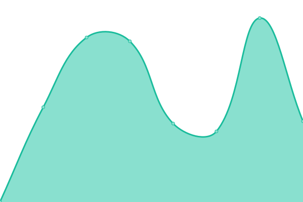

# LTMPT Upptime (tidak resmi)

Selamat datang di repositori status Upptime tidak resmi **[LTMPT](https://ltmpt.ac.id)**.

Ini adalah repository status untuk situs-situs [LTMPT](https://ltmpt.ac.id). Halaman status dan repositori yang terkait memantau situs-situs tersebut secara gratis berkat [Upptime](https://github.com/upptime/upptime).

Layanan ini dibuat karena situs-situs LTMPT sering mati dikarenakan satu dan lain hal.

---

Welcome to **[LTMPT](https://ltmpt.ac.id)**'s (unofficial) Upptime status repository.

This is the status repository for [LTMPT](https://ltmpt.ac.id) websites. The page and it's repository monitors them for free, using only GitHub services, thanks to [Upptime](https://github.com/upptime/upptime).

This service is made because the sites of LTMPT is often offline due to various reasons.

For outsiders, The Institution/Agency of University Entrance Exams (Lembaga Tes Masuk Perguruan Tinggi, LTMPT) is a goverment institution that administers college entrance exams in Indonesia. Think of it as the CollegeBoard of Indonesia, but it is made by the goverment and doesn't have shady practices.

Live status: <!--live status--> **Semua sistem beroperasi**

## [📈 Status](https://ltmpt-upptime.netlify.app)

<!--start: status pages-->
<!-- This summary is generated by Upptime (https://github.com/upptime/upptime) -->
<!-- Do not edit this manually, your changes will be overwritten -->
<!-- prettier-ignore -->
| URL | Status | History | Response Time | Uptime |
| --- | ------ | ------- | ------------- | ------ |
|  [Situs Utama LTMPT](https://ltmpt.ac.id) | Aktif | [situs-utama-ltmpt.yml](https://github.com/Hans5958/LTMPT-Upptime/commits/HEAD/history/situs-utama-ltmpt.yml) | 

 5317ms
     
 | 

<a href="https://ltmpt-upptime.netlify.app/history/situs-utama-ltmpt">100.00%</a>
    

|  [Portal LTMPT](https://portal.ltmpt.ac.id) | Aktif | [portal-ltmpt.yml](https://github.com/Hans5958/LTMPT-Upptime/commits/HEAD/history/portal-ltmpt.yml) | 

 1911ms
     
 | 

<a href="https://ltmpt-upptime.netlify.app/history/portal-ltmpt">100.00%</a>
    

|  [Laman Unduhan LTMPT](https://download.ltmpt.ac.id/) | Aktif | [laman-unduhan-ltmpt.yml](https://github.com/Hans5958/LTMPT-Upptime/commits/HEAD/history/laman-unduhan-ltmpt.yml) | 

 682ms
     
 | 

<a href="https://ltmpt-upptime.netlify.app/history/laman-unduhan-ltmpt">100.00%</a>
    

<!--end: status pages-->
